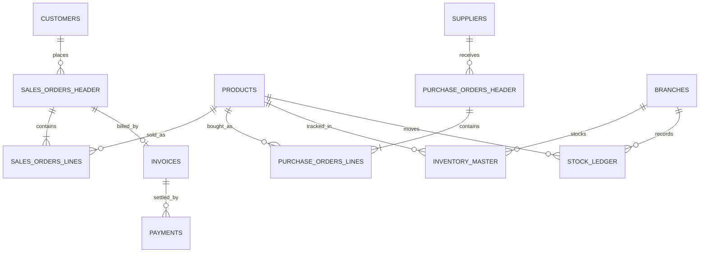

<div align="center">


<br/>


</div>

---

## About the project

A 12-week applied data project on heavy-equipment supply-chain data. The goal is to **reduce dead stock, prevent stockouts, and improve supplier reliability** across six warehouses.

The project covers supplier performance, inventory optimisation, warehouse operations, and demand forecasting.

## Dataset at a glance

<div align="center">

</div>

| Item | Value |
|---|---|
| Time period | 2019 – 2024 |
| Customers | 500 |
| Suppliers | 8 |
| Products (SKUs) | 30 |
| Warehouses (branches) | 6 |
| Purchase orders | 24,000 |

<div align="center">

</div>

> **Data note:** 2,370 purchase orders (9.9%) have no received date yet. They are flagged as *pending* and left blank, not filled in. The validation checks are recorded in `docs/validation_log.csv`.

<div align="center">

</div>

## Data model



## Roadmap

<div align="center">

</div>

- [ ] Week 1 — Dataset exploration and exploratory data analysis
- [ ] Week 2 — Data cleaning and missing-value treatment
- [ ] Week 3 — SQL database design and data validation
- [ ] Week 4 — Supplier performance analysis
- [ ] Week 5 — Inventory health and dead-stock analysis
- [ ] Week 6 — Stockout and replenishment analysis
- [ ] Week 7 — Warehouse performance comparison
- [ ] Week 8 — Demand forecasting
- [ ] Week 9 — Inventory optimisation models
- [ ] Week 10 — KPI dashboard development in Power BI
- [ ] Week 11 — Model evaluation and business recommendations
- [ ] Week 12 — Final report, documentation, and deployment

## Key KPIs

KPIs are calculated from validated source data. No unverified results are reported.

| Area | KPIs |
|---|---|
| Supplier | On-time delivery rate · Fulfilment rate · Average lead time · Defect rate · Reliability score |
| Inventory | Turnover ratio · Days of inventory on hand · Stockout rate · Dead-stock value · Carrying cost · Reorder-point accuracy |
| Warehouse | Fulfilment rate · Order cycle time · Backorder rate · Branch utilisation · Fill rate |
| Finance | Outstanding invoice value · Days sales outstanding · Purchase-order ageing |
| Forecasting | Forecast accuracy |

## Models to build

- Demand forecasting (statistical and machine-learning methods)
- Supplier reliability scoring
- Inventory segmentation using ABC analysis
- Reorder-point and safety-stock estimation
- Stockout risk prediction
- Dead-stock identification
- Inventory optimisation recommendations

## Quick start

**1. Clone the repository**

```bash
git clone https://github.com/HARSHPANDEY9756/cadetx-warehouse-analytics.git
cd cadetx-warehouse-analytics
```

**2. Create a virtual environment**

```bash
python -m venv .venv
```

Windows PowerShell:

```powershell
.\.venv\Scripts\Activate.ps1
```

**3. Install dependencies**

```bash
python -m pip install --upgrade pip
pip install pandas numpy scikit-learn statsmodels matplotlib seaborn jupyter sqlalchemy
```

**4. Explore the dataset**

```bash
jupyter notebook notebooks/week-01-eda.ipynb
```

**5. Run the data-cleaning pipeline**

```bash
python src/data_cleaning.py
```

**6. Rebuild the README charts (optional)**

Edit `assets/metrics.json`, then run:

```bash
python scripts/build_readme_assets.py
```

The charts also rebuild automatically on GitHub when `metrics.json` changes (see `.github/workflows/update-readme-assets.yml`).

**Prerequisites:** Python 3.8 or later, the project dataset (download from the CadetX portal), and the notebook and script files above. If the project uses SQL Server, configure the database connection separately.

## Technology stack

| Category | Tools |
|---|---|
| Programming | Python |
| Data analysis | Pandas, NumPy |
| Machine learning | Scikit-learn, Statsmodels |
| Visualisation | Matplotlib, Seaborn, Power BI |
| Database | SQL Server, T-SQL, SQLAlchemy |
| Development | Jupyter Notebook, Google Colab |
| Version control | Git, GitHub |

## Repository structure

```
cadetx-warehouse-analytics/
├── .github/workflows/update-readme-assets.yml
├── assets/              # SVG charts and metrics.json (used by this README)
├── data/                # Raw and cleaned data (large files are git-ignored)
├── docs/                # validation_log.csv, data_dictionary.csv, results_table.md
├── notebooks/           # week-01-eda.ipynb and later notebooks
├── scripts/             # build_readme_assets.py
├── src/                 # data_cleaning.py
├── .gitignore
├── README.md
└── requirements.txt
```

Adjust this structure to match the files actually in your repository.

## Project progress

Progress is tracked in the roadmap above and in the chart at the top of that section. Add validated charts, model results, and Power BI screenshots as the project develops.

## Author

**Harsh Pandey** — Data Science Analyst

- GitHub: [github.com/harshpandey97](https://github.com/harshpandey97)
- LinkedIn: [linkedin.com/in/harsh-pandey-395a10237](https://www.linkedin.com/in/harsh-pandey-395a10237)
- Email: harshpandey6012@gmail.com

## License

Released under the MIT License. Add a `LICENSE` file to the repository to make this official.
